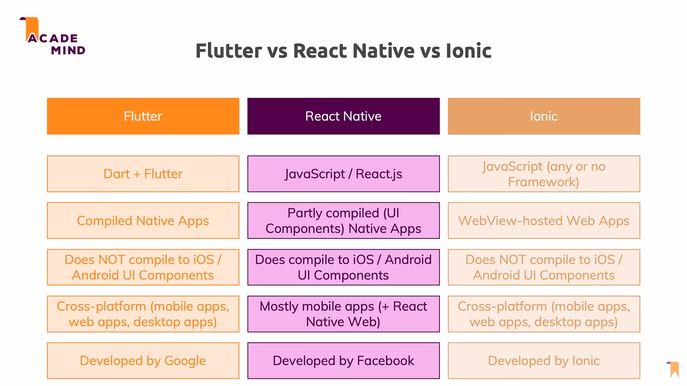

# FLUTTER - WORKSHOP

***

* [Anthony Vandersmissen](https://www.linkedin.com/in/anthony-vandersmissen/)
* [Balthazar Delvaux](https://www.linkedin.com/in/balthazar-delvaux/)
* [Lorenzo Menozzi](https://www.linkedin.com/in/lorenzo-menozzi/)
* [Fabien Desablens](https://www.linkedin.com/in/fabien-desablens)

***
### Table des matières
1. Installation
   * [Linux](installation_linux.md)
   * [Windows](installation_windows.md)
   * [macOS](https://flutter.dev/docs/get-started/install/macos)
2. 

***
### Qu’est-ce que Flutter

Flutter est la boîte à outils de l'interface utilisateur de Google permettant de créer de superbes applications compilées de manière native pour mobile, Web et de bureau à partir d'une base de code unique.

***
### Différences entre Flutter et les autres frameworks

***
### Étape suivante ...

##### [Windows](installation_windows.md)  
##### [Linux](installation_linux.md)